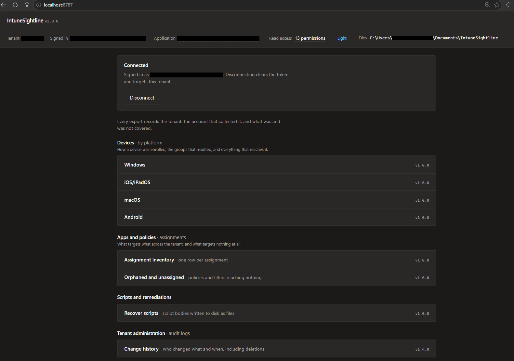
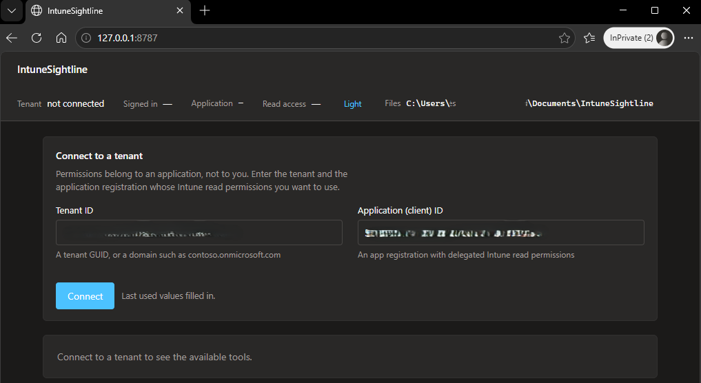

# IntuneSightline

Read-only reporting for Microsoft Intune. Six tools that answer questions the admin
center answers badly, and write the answer to a workbook or a self-contained HTML page.

No modules to install. No app registration required. Nothing writes to your tenant.



Connect page




Every tool's output for this same launch page is in [`docs/samples`](docs/samples) -
fabricated data, a fictional tenant, nothing real. Open one to see the shape of the
output before running anything against your own tenant.

```powershell
./Start-IntuneSightline.ps1
```

A preflight check runs, then a page opens at `127.0.0.1:8787`. Enter your tenant ID and
the application ID of a registration with delegated Intune read permissions, press
Connect, and sign in. Both values are remembered.

## The problem

The Intune admin center cannot tell you everything that targets a group. It will not show
you which policies are assigned to nothing. It cannot explain why one device behaves
differently from the one next to it. And it will not give you your scripts back as files.

Each tool here answers one of those.

## Tools

| Tool | Answers |
|---|---|
| Windows device journey | How a Windows device was enrolled, the groups that resulted, and everything that reaches it |
| iOS/iPadOS device journey | How an iPhone or iPad was enrolled, the groups that resulted, and everything that reaches it |
| macOS device journey | How a Mac was enrolled, the groups that resulted, and everything that reaches it |
| Android device journey | How an Android device was enrolled, the groups that resulted, and everything that reaches it |
| Assignment inventory | One row per assignment: what targets what, across the whole tenant |
| Orphaned and unassigned | Finds policies, scripts and filters that nothing is assigned to or that target nothing |
| Recover scripts | Pulls script bodies out of Intune and writes them to disk as files |
| Change history | Who changed what and when, from the Intune audit log. Includes deletions and renames |

## What it will not do

**It does not render reports in the browser.** Tools write files. The page shows progress
and a link to the output folder, nothing more. That keeps the interface the same size
whether there are six tools or sixty.

**It does not write to your tenant.** Every Graph call is a read, and a tool declaring a
write permission is rejected when it loads.

**It does not listen on the network.** The server binds to `127.0.0.1` only.

## The launch page and the reports both follow the Intune admin centre

Tools are grouped by the same headings Intune itself uses — Devices, Apps and
policies, Scripts and remediations, Tenant administration — so nothing on the page
needs learning separately from the portal you already know.

Both the launch page and every HTML report support a light and a dark theme, matching
your system by default with a toggle to override it. An HTML report opens in whichever
theme you were using when you ran it, and always prints on a plain white background
regardless of screen theme, so a copy attached to a ticket stays legible.

## Every export says what it could see

A snapshot is not "the tenant" — it is what one account could read. Scope tags, licensing
and throttling all filter results, so two admins running the same tool can legitimately
get different files.

Every export therefore carries the tenant, the collecting account, the permissions it
held, and a per-source coverage list. A source marked `INCOMPLETE` means results absent
from the export may still exist.

Clean is not the same as complete, and the file says which one you have.

## Architecture

```
browser  ──HTTP 127.0.0.1──  shell  ──dispatch──  tools  ──calls──  core
                                                                      │
                                                        Graph (read) ─┴─ files out
```

**shell** serves the page, builds each tool's form from its manifest, runs one job at a
time in a background runspace, and relays progress. It contains no tool-specific code —
a check fails the build if it ever does.

**tools** are independent. Each is a manifest plus one script. Drop a folder in, reload
the page, and it appears.

**core** is a library tools call: authentication, Graph paging and throttling, batching,
output paths, provenance. Core never calls tools.

Platform differences — paths, opening files, launching a browser — live in one file.

See [docs/architecture.md](docs/architecture.md) for the tool contract and the reasoning.

## Permissions

Sign-in requests `https://graph.microsoft.com/.default`, which returns exactly the
permissions your tenant has already consented for that application — no more. A tool
whose permissions are missing is greyed out with the specific permission named, rather
than failing partway through.

Write permissions are dropped from the working set at sign-in and the discarded list is
printed. See [SECURITY.md](SECURITY.md).

## Requirements

PowerShell 7.0 or later. An Intune-licensed tenant. An account with delegated read
permissions on device management.

Tested on Windows and macOS. Nothing in it is Windows-specific.

## Known limitations

- **Encrypted OMA-URI values cannot be read.** Graph returns a placeholder; the real
  value needs a per-setting authenticated call and cannot be decrypted offline.
- **Some data lives on two endpoints.** Security baselines split between
  `deviceManagement/intents` and `configurationPolicies`. Querying one silently misses
  the other, so both are read.
- **Audit filtering is limited to date and activity type.** The actor and the affected
  resource are nested objects Intune will not filter on, so a "changed by" filter is
  applied after collection. Run time follows how many events happened, not how many match.
- **Entra does not record when a device joined a dynamic group.** Reports show how
  membership arises, not when it began.
- **Conditional Access, on-premises Group Policy and local policy are out of scope.**
  They affect real outcomes and cannot be seen from here.

## Checks

```powershell
./tests/Invoke-Checks.ps1
```

Static checks needing no tenant, run on every push and pull request. Each exists because
something shipped broken. Functional testing needs a tenant and is done by hand.

## Licence

MIT. See [LICENSE](LICENSE).
